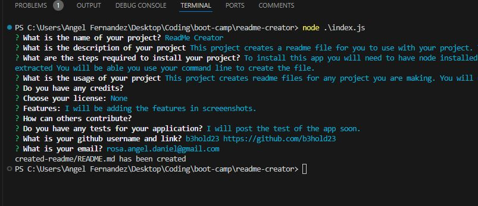

# ReadMe Creator

## Description
This project creates a readme file for you to use with your project. This project used node.js to take your info and create a read me for it. 

## Table of Contents
- [Installation](#installation)
- [Usage](#usage)
- [Credits](#credits)
- [License](#license)
- [Features](#features)
- [Contribute](#contribute)
- [Tests](#tests)

## Installation
To install this app you will need to have node installed on your system. Once that has bee installed you will need to download the zip file. Once that is downloaded and extracted You will be able you use your command line to create the file.

## Usage
This project creates readme files for any project you are making. You will use the command line to answer some question and it will create the file for you.

## Credits

## License

  

## Features
Some great features with this project is mainly the badges. Below I have provided a the code snippet showing which license are available to you with this project. 

## Contribute

## Tests
I will post the test of the app soon.

## My Info
My github:
 
b3hold23 https://github.com/b3hold23 
 
My email:
 
 rosa.angel.daniel@gmail.com